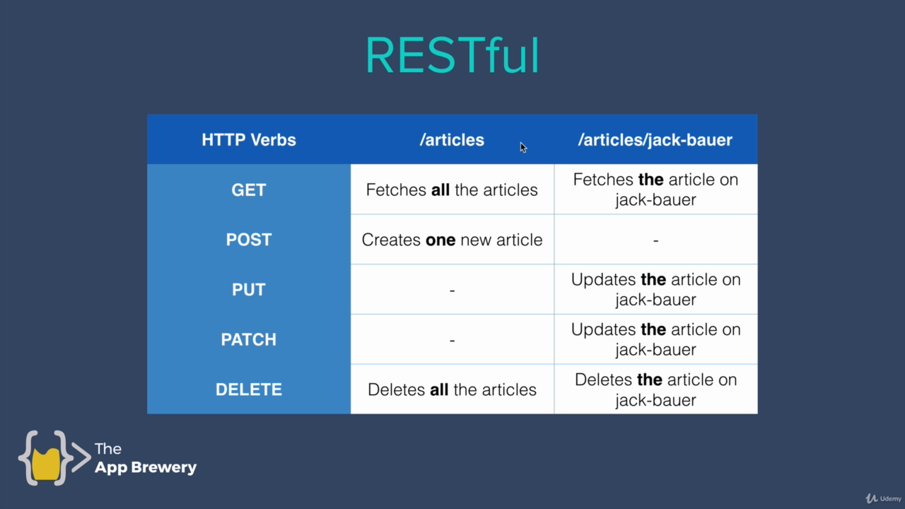
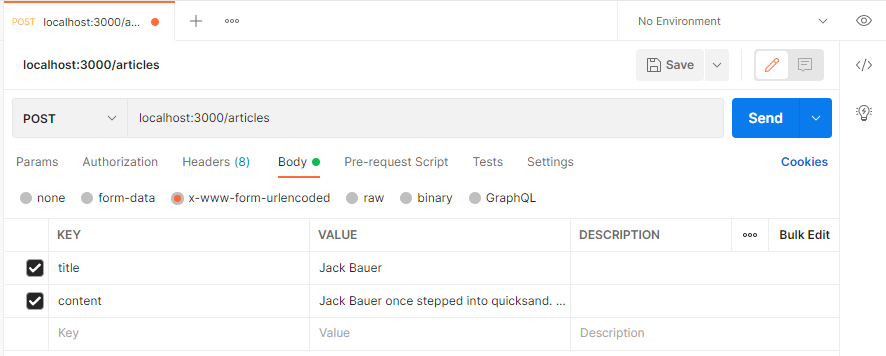
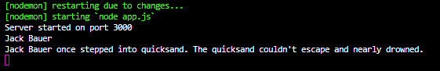

# Building a RESTful API

## Robo 3T
This is a graphical interface for doing some basic stuff on mongodb.

You can download it from here;
https://robomongo.org/

Once the setup is done, just create a connection and connect to it.

**You need to start mongod from the console or else it won't connect.**

## Sample Database

 - Create a database called **wikiDB**
 - Create a collection called **articles**
 - Insert sample documents
 
 sample document example;

     {
        "_id" : ObjectId("6107c949f84b2505c218cd12"),
        "title" : "REST",
        "content" : "REST is short for REpresentational State Transfer. It's an architectural style for desinging APIs."
    }

More document examples;
https://github.com/londonappbrewery/Build-Your-Own-RESTful-API

## Setting up the Server

### Challenges

**1) Create a new Directory called Wiki-API**

Literally just create a folder called Wiki-API inside of your web dev folder.

**2) Initialise NPM and install mongoose, ejs and express**

cd into your Wiki-API folder from the console and initialize npm

    npm init

and after initialising npm, install mongoose, ejs and express

    npm i mongoose ejs express

**3) Create a new file called app.js**

Self-explanatory. 

**4) Inside app.js add the starting server code**

file: app.js
line:1-15
code:
```javascript
const express = require("express");
const  mongoose = require('mongoose');
const ejs = require("ejs");

const app = express();

app.set('view engine', 'ejs');

app.use(express.json());
app.use(express.urlencoded({ extended:  true }));
app.use(express.static("public"));

app.listen(3000, function() {
  console.log("Server started on port 3000");
});
```

**5) Setup MongoDB**

 - DB name is **wikiDB**
 - Collection name is **articles**
 - Document has 2 fields: **title** and **content**

file: app.js
line:5
code:
```javascript
mongoose.connect('mongodb://localhost:27017/wikiDB', {useNewUrlParser:  true, useUnifiedTopology:  true});
```

file: app.js
line:15-24
code:
```javascript
const  articleSchema = {
	name:  String,
  content: String
};

const Article = mongoose.model("Article", articleSchema);
```

**Mongo automatically changes the "Article" to "articles" with its algorithm.**

## RESTful



**In order to make our API RESTful, we're going to go through this table and create each of these routes.**

## GET Route

file: app.js
line:22-30
code:
```javascript
app.get("/articles", function(req,res){
  Article.find(function(err, foundArticles) {
    if(!err){
      res.send(foundArticles);
    } else {
      res.send(err);
    }
  })
})
```
This finds all of the documents in the articles collection and sends it back.

If there aren't any errors, you can see the documents at http://localhost:3000/articles

For a better viewing experience install this chrome extension called **JSON Viewer Pro**: 
https://chrome.google.com/webstore/detail/json-viewer-pro/eifflpmocdbdmepbjaopkkhbfmdgijcc/

## POST Route

To test posting, we can download **Postman** from
https://www.postman.com/downloads/

file: app.js
line:32-35
code:
```javascript
app.post("/articles", function(req,res) {
  console.log(req.body.title);
  console.log(req.body.content);
})
```
now we need to open up Postman and see if we can console log some inputs.



Create a new **POST request** in Postman.

Insert our **localhost:3000/articles** url.

Choose **Body** and choose **x-www-form-urlencoded**

Type in **title** and **content** keys and their values.

Click on SEND.



And as we can see on the console, it logged our post request.

file: app.js
line:32-45
code:
```javascript
app.post("/articles", function(req,res) {

  const newArticle= new Article({
    title: req.body.title,
    content: req.body.content
  })
  newArticle.save(function(err) {
    if(!err){
      res.send("Successfully added a new article.")
    }else{
      res.send(err);
    }
  });
})
```
Now we can refactor our code like this to send that data into the database.

After sending the same thing from Postman, this time it saves it into our wikiDB.

## Delete Route

file: app.js
line:47-55
code:
```javascript
app.delete("/articles", function(req,res) {
  Article.deleteMany(function(err) {
    if(!err){
      res.send("Successfully deleted all articles.");
    } else{
      res.send(err);
    }
  })
})
```
After saving this code, choose the delete option in Postman and SEND.

**This will delete all of the documents so you might want to copy them before deleting.**
