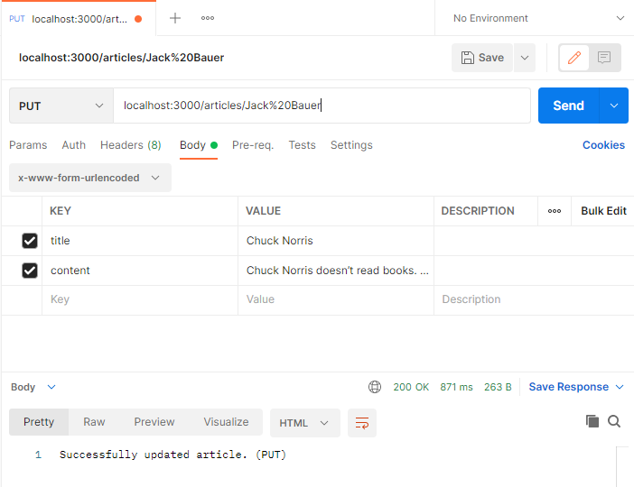
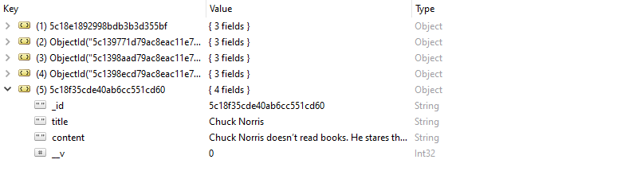
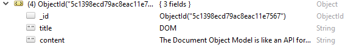
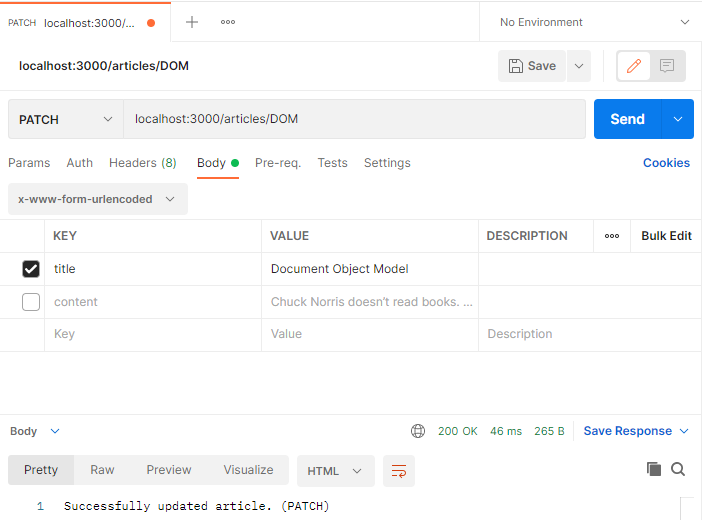
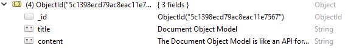

# Building a RESTful API

## Robo 3T
This is a graphical interface for doing some basic stuff on mongodb.

You can download it from here;
https://robomongo.org/

Once the setup is done, just create a connection and connect to it.

**You need to start mongod from the console or else it won't connect.**

## Sample Database

 - Create a database called **wikiDB**
 - Create a collection called **articles**
 - Insert sample documents
 
 sample document example;

     {
        "_id" : ObjectId("6107c949f84b2505c218cd12"),
        "title" : "REST",
        "content" : "REST is short for REpresentational State Transfer. It's an architectural style for desinging APIs."
    }

More document examples;
https://github.com/londonappbrewery/Build-Your-Own-RESTful-API

## Setting up the Server

### Challenges

**1) Create a new Directory called Wiki-API**

Literally just create a folder called Wiki-API inside of your web dev folder.

**2) Initialise NPM and install mongoose, ejs and express**

cd into your Wiki-API folder from the console and initialize npm

    npm init

and after initialising npm, install mongoose, ejs and express

    npm i mongoose ejs express

**3) Create a new file called app.js**

Self-explanatory. 

**4) Inside app.js add the starting server code**

file: app.js
line:1-15
code:
```javascript
const express = require("express");
const  mongoose = require('mongoose');
const ejs = require("ejs");

const app = express();

app.set('view engine', 'ejs');

app.use(express.json());
app.use(express.urlencoded({ extended:  true }));
app.use(express.static("public"));

app.listen(3000, function() {
  console.log("Server started on port 3000");
});
```

**5) Setup MongoDB**

 - DB name is **wikiDB**
 - Collection name is **articles**
 - Document has 2 fields: **title** and **content**

file: app.js
line:5
code:
```javascript
mongoose.connect('mongodb://localhost:27017/wikiDB', {useNewUrlParser:  true, useUnifiedTopology:  true});
```

file: app.js
line:15-24
code:
```javascript
const  articleSchema = {
	title:  String,
	content: String
};

const Article = mongoose.model("Article", articleSchema);
```

**Mongo automatically changes the "Article" to "articles" with its algorithm.**

## RESTful


**In order to make our API RESTful, we're going to go through this table and create each of these routes.**

## GET Route

file: app.js
line:22-30
code:
```javascript
app.get("/articles", function(req,res){
  Article.find(function(err, foundArticles) {
    if(!err){
      res.send(foundArticles);
    } else {
      res.send(err);
    }
  })
})
```
This finds all of the documents in the articles collection and sends it back.

If there aren't any errors, you can see the documents at http://localhost:3000/articles

For a better viewing experience install this chrome extension called **JSON Viewer Pro**: 
https://chrome.google.com/webstore/detail/json-viewer-pro/eifflpmocdbdmepbjaopkkhbfmdgijcc/

## POST Route

To test posting, we can download **Postman** from
https://www.postman.com/downloads/

file: app.js
line:32-35
code:
```javascript
app.post("/articles", function(req,res) {
  console.log(req.body.title);
  console.log(req.body.content);
})
```
now we need to open up Postman and see if we can console log some inputs.


Create a new **POST request** in Postman.

Insert our **localhost:3000/articles** url.

Choose **Body** and choose **x-www-form-urlencoded**

Type in **title** and **content** keys and their values.

Click on SEND.


And as we can see on the console, it logged our post request.

file: app.js
line:32-45
code:
```javascript
app.post("/articles", function(req,res) {

  const newArticle= new Article({
    title: req.body.title,
    content: req.body.content
  })
  newArticle.save(function(err) {
    if(!err){
      res.send("Successfully added a new article.")
    }else{
      res.send(err);
    }
  });
})
```
Now we can refactor our code like this to send that data into the database.

After sending the same thing from Postman, this time it saves it into our wikiDB.

## DELETE Route

file: app.js
line:47-55
code:
```javascript
app.delete("/articles", function(req,res) {
  Article.deleteMany(function(err) {
    if(!err){
      res.send("Successfully deleted all articles.");
    } else{
      res.send(err);
    }
  })
})
```
After saving this code, choose the delete option in Postman and SEND.

**This will delete all of the documents so you might want to copy them before deleting.**

## Chainable Route

Here is an example of chained route handlers that are defined by using `app.route()`.

```javascript
app.route('/book')
  .get(function (req, res) {
    res.send('Get a random book')
  })
  .post(function (req, res) {
    res.send('Add a book')
  })
  .put(function (req, res) {
    res.send('Update the book')
  })
```

Here is our code after using the chained routes.

file: app.js
line:22-55
code:
```javascript
app.route("/articles")
  .get(function(req,res){
    Article.find(function(err, foundArticles) {
      if(!err){
        res.send(foundArticles);
      } else {
        res.send(err);
      }
    })
  })
  
  .post(function(req,res) {

    const newArticle= new Article({
      title: req.body.title,
      content: req.body.content
    })
    newArticle.save(function(err) {
      if(!err){
        res.send("Successfully added a new article.")
      }else{
        res.send(err);
      }
    });
  })
  
  .delete(function(req,res) {
    Article.deleteMany(function(err) {
      if(!err){
        res.send("Successfully deleted all articles.");
      } else{
        res.send(err);
      }
    })
  });

```
## GET a Specific Article

In order to get a specific title, we must first give our url a custom name and call that name in the function to see if it matches up.

file: app.js
line:56-66
code:
```javascript
  app.route("/articles/:articleTitle")
  .get(function(req,res) {
    Article.findOne({title: req.params.articleTitle}, function(err, foundArticle) {
      if(!err){
        res.send(foundArticle)
      }else(
        res.send("No articles matching that title was found.")
      )
    });
  });
```

After saving this code and sending a **GET request** from **Postman** on the URL **localhost:3000/articles/REST** , we get this output;

    {
        "_id": "5c18e1892998bdb3b3d355bf",
        "title": "REST",
        "content": "REST is short for REpresentational State Transfer. IIt's an architectural style for designing APIs."
    }

## URL's with spaces

If we're looking for a title name with spaces in it like **"Jack Bauer"**, we must put **%20** instead of the **space**. 

**"Jack Bauer" ----> "Jack%20Bauer"**

You can look at the HTML URL Encoding References here:

https://www.w3schools.com/tags/ref_urlencode.ASP

So in our example, the URL would be;

**localhost:3000/articles/Jack%20Bauer**

## PUT(Update) a Specific Document

file: app.js
line:68-81
code:
```javascript
    .put(function(req,res) {
      Article.updateMany(
        {title: req.params.articleTitle},
        {$set: {title: req.body.title, content: req.body.content} },
        //{multi: true, upsert: false, overwrite: true}, //<----Use these if there are any errors.
        function(err) {
          if(!err){
            res.send("Successfully updated article. (PUT)");
          }
        }

      )
      
    })
```

This finds the document that has the title value of our specifed url.

**localhost:3000/articles/Jack%20Bauer ---> It will find the document that has the title value of "Jack Bauer"**

After finding the document, it will set the new title and content values.

**Postman;**



**Sent a PUT request that changes the title and content**

**⬇️⬇️⬇️⬇️⬇️⬇️⬇️⬇️⬇️⬇️⬇️⬇️⬇️⬇️⬇️⬇️⬇️⬇️⬇️⬇️⬇️⬇️⬇️**



**Our Jack Bauer document got updated and it become Chuck Norris.**


## PATCH(Update) a Specific Document

file: app.js
line:83-95
code:
```javascript
    .patch(function(req,res) {
      Article.updateMany(
        {title: req.params.articleTitle},
        {$set: req.body},
        function(err) {
          if(!err){
            res.send("Successfully updated article. (PATCH)");
          } else{
            res.send(err);
          }
        }
      );
    });
```
Using the **req.body** it gets whatever we want to change automatically.





**We have only changed the title of the document.**

**⬇️⬇️⬇️⬇️⬇️⬇️⬇️⬇️⬇️⬇️⬇️⬇️⬇️⬇️⬇️⬇️⬇️⬇️⬇️⬇️⬇️⬇️⬇️**



## Difference between PUT and PATCH

**PUT wants to update by changing the whole document but PATCH only updates the given parameters.**

    {
    "_id" : ObjectId("5c139771d79ac8eac11e754a"),
    "title" : "API",
    "content" : "API stands for Application Programming Interface."
    }
***Let's say we have this document.***

**If we send a PUT request that only wants to change the title, content will be set to NULL.**

    {
    "_id" : ObjectId("5c139771d79ac8eac11e754a"),
    "title" : "API changed",
    "content" : NULL
    }

**However, if we send a PATCH request that only wants to change the title, content will remain the same.**

    {
    "_id" : ObjectId("5c139771d79ac8eac11e754a"),
    "title" : "API changed",
    "content" : "API stands for Application Programming Interface."
    }
